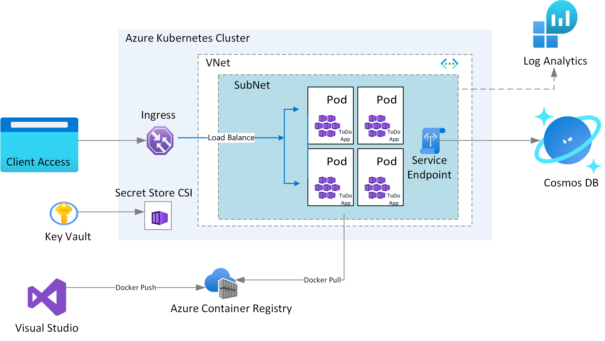
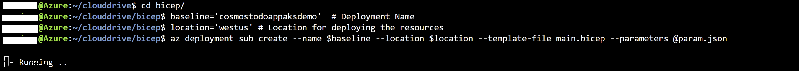
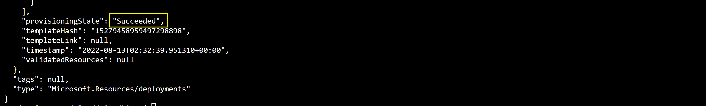
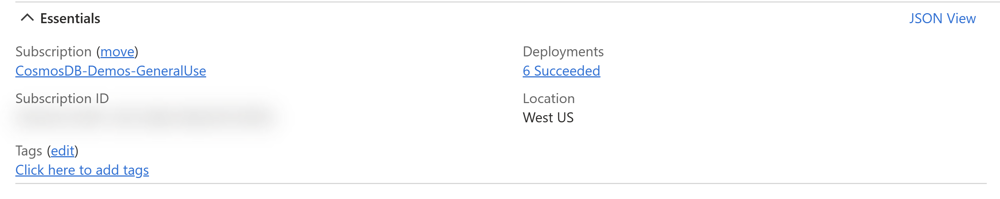

# AKS Cluster, Cosmos DB, and ACR using Bicep

## Overview

This repository explains on how to use modular approach for Infrastructure as Code to provision a AKS cluster and few related resources. 

The [Bicep](https://docs.microsoft.com/azure/azure-resource-manager/bicep/overview?tabs=bicep) modules in the repository are designed keeping baseline architecture in mind. You can start using these modules as is or modify to suit the needs.

The Bicep modules will provision the following Azure Resources under subscription scope.

1. A Resource Group
2. A Managed Identity
3. An Azure Container Registry for storing images
4. A VNet required for configuring the AKS (optional)
5. An AKS Cluster
6. A Cosmos DB SQL API Account along with a Database, Container, and SQL Role to manage RBAC
7. A Log Analytics Workspace (optional)

### Architecture



### Securing the Cosmos DB account

You can configure the Azure Cosmos DB account to:

1. Allow access only from a specific subnet of a virtual network (VNET) **or** make it accessible from any source.
2. Authorize request accompanied by a valid authorization token **or** restrict access using RBAC and Managed Identity.

For simplicity we have not implemented them in this sample. Consider using the following best practices to enhance security of the Azure Cosmos DB account in Production applications.

1. Limits access to the subnet by [configuring a virtual network service endpoint](https://docs.microsoft.com/azure/cosmos-db/how-to-configure-vnet-service-endpoint). 
1. Set disableLocalAuth = true in the databaseAccount resource to [enforce RBAC as the only authentication method](https://docs.microsoft.com//azure/cosmos-db/how-to-setup-rbac#disable-local-auth).

Refer to the comments in *Bicep\modules\cosmos\cosmos.bicep*, and *Bicep\modules\vnet\vnet.bicep* files and edit these files as required to apply the above mentioned restrictions.

## Deploy infrastructure with Bicep

**1. Clone the repository**

Clone the repository and move to Bicep folder

```azurecli
cd Bicep
```

**2. Login to your Azure Account**

```azurecli
az login

az account set -s <Subscription ID>
```


**3. Initialize Parameters**

Create a param.json file by using the following JSON, replace the {Resource Group Name}, {Cosmos DB Account Name}, and {ACR Instance Name}placeholders with your own values for Resource Group Name, Cosmos DB Account Name, and Azure Container Registry instance Name. Refer to [Naming rules and restrictions for Azure resources](https://docs.microsoft.com/azure/azure-resource-manager/management/resource-name-rules).

```json
{
  "$schema": "https://schema.management.azure.com/schemas/2019-04-01/deploymentParameters.json#",
  "contentVersion": "1.0.0.0",
  "parameters": {
    "rgName": {
      "value": "{Resource Group Name}"
    },    
    "cosmosName" :{
      "value": "{Cosmos DB Account Name}"
    },
    "acrName" :{
      "value": "{ACR Instance Name}"
    },
    "throughput" :{
        "value": 11000
    }
  }
}
```
**Caution** The default settings provision an autoscale throughput of 11,000 RU/s to the **OrderContainer** Cosmos DB container. This sets the number of its [physical partitions](https://docs.microsoft.com/azure/cosmos-db/partitioning-overview#physical-partitions) to 2.

**4. Run Deployment**

Run the following script to create the deployment

```azurecli
deploymentName='{Deployment Name}'  # Deployment Name
location='{Location}' # Location for deploying the resources

az deployment sub create --name $deploymentName --location $location --template-file main.bicep --parameters @param.json
```



The deployment could take about 10 mins. Once provisioning is completed you should see a JSON output with Succeeded as provisioning state.



You can also see the deployment status in the Resource Group



**5. Link Azure Container Registry with AKS**

Set the environment variables by replacing the {ACR Instance Name}, {Resource Group Name}, and {AKS Cluster Name} placeholders with your own values. Ensure that the below values for {ACR Instance Name} and {Resource Group Name} placeholders match with values supplied in param.json.

```azurecli

acrName='{ACR Instance Name}'
rgName='{Resource Group Name}'

```

Run the below command to integrate the ACR with the AKS cluster

```azurecli

aksName=$rgName'aks'
az aks update -n $aksName -g $rgName --attach-acr $acrName
```

**6. Sign in to AKS CLuster**

Use the below command to sign in to your AKS cluster. This command also downloads and configures the kubectl client certificate on your environment.

```azurecli
az aks get-credentials -n $aksName -g $rgName
```

**7. Deploy KEDA and External Scaler**

Use the below command to add and update Helm chart repo.

```azurecli
helm repo add kedacore https://kedacore.github.io/charts
helm repo update
```
Use the below command to install KEDA Helm chart (or follow one of the other installation methods on KEDA documentation).

```azurecli
helm install keda kedacore/keda --namespace keda --create-namespace
```
Alternatively, You can use the mangaged AKS addon for Keda - install the AKS KEDA add-on with Azure CLI:

Register the AKS-KedaPreview feature flag by using the az feature register command, as shown in the following example:
```azurezli
az feature register --namespace "Microsoft.ContainerService" --name "AKS-KedaPreview"
```
It takes a few minutes for the status to show Registered. Verify the registration status by using the az feature show command:
```azurezli
az feature show --namespace "Microsoft.ContainerService" --name "AKS-KedaPreview"
```
When the status reflects Registered, refresh the registration of the Microsoft.ContainerService resource provider by using the az provider register command:
```azurecli
az provider register --namespace Microsoft.ContainerService
```
To install the KEDA add-on, use --enable-keda when creating or updating a cluster.
```azurecli
az aks update \
  --resource-group myResourceGroup \
  --name myAKSCluster \
  --enable-keda
  ```
Use the below command to install Azure Cosmos DB external scaler Helm chart.

```azurecli
helm install external-scaler-azure-cosmos-db kedacore/external-scaler-azure-cosmos-db --namespace keda --create-namespace
```

For more information refer to [Deploying KEDA](https://keda.sh/docs/deploy/) documentation page to deploy KEDA on your Kubernetes cluster.

## Testing sample application locally on Docker

**>Note** For simplicity, we will use the connection string method to connect locally (using docker) to Azure Cosmos DB. Once deployed to the AKS cluster the applications will use Managed Identity for Connection. Managed Identity is more secure as there is no risk of accidentally leaking the connection string.

1. On your development machine clone the repo.
1. Open command prompt or shell and change to the root directory of the cloned repo.
1. Run the below commands to build the Docker container images for order-generator and order-processor applications.

    ```dotnetcli
    
    docker build --file .\src\Scaler.Demo\OrderGenerator\Dockerfile --force-rm --tag cosmosdb-order-generator .\src
    docker build --file .\src\Scaler.Demo\OrderProcessor\Dockerfile --force-rm --tag cosmosdb-order-processor .\src
    ```

1. Start a new shell instance and run the order-processor application in a new container. You can put the same connection string in both places in the command below. Note that the sample applications are written to handle different Cosmos DB accounts for monitored and lease containers but having two different accounts is not a requirement.

    ```dotnetcli

    docker run --env CosmosDbConfig__Connection="<connection-string>" --env CosmosDbConfig__LeaseConnection="<connection-string>" --interactive --rm --tty cosmosdb-order-processor
    ```

    You should see the following result.

    ```text

    2023-05-15 13:05:38 info: Keda.CosmosDb.Scaler.Demo.OrderProcessor.Worker[0]
          Started change feed processor instance Instance-b0001b3034c7
    2023-05-15 13:05:38 info: Microsoft.Hosting.Lifetime[0]
          Application started. Press Ctrl+C to shut down.
    2023-05-15 13:05:38 info: Microsoft.Hosting.Lifetime[0]
          Hosting environment: Production
    2023-05-15 13:05:38 info: Microsoft.Hosting.Lifetime[0]
      Content root path: /app
    ```

    The default application settings would share the same database between the monitored and lease containers. The order-processor application will then activate a change-feed processor to monitor and process new changes in the monitored container.

1. Keep the order-processor application running. Start a second shell instance and run order-generator application to add fake orders to the **OrderContainer** Cosmos DB container.

    ```dotnetcli
    docker run --env CosmosDbConfig__Connection="<connection-string>" --interactive --tty --rm cosmosdb-order-generator true 10 false
    ```

    You should see the following result.

    ```text
    Creating order 252d35a5-4064-455a-abbf-0ae55edf92d3 - 10 unit(s) of Hat for Kenya Greenfelder
    Creating order 179a3af0-388f-4e1e-aaf3-e688f4262366 - 8 unit(s) of Salad for Gabe Witting
    Creating order 20df0b3c-a8e7-4ed0-b815-d14769067b31 - 2 unit(s) of Ball for Lucio Reilly
    Creating order 1ac64394-15ac-4310-91d8-bbb35d646461 - 9 unit(s) of Ball for Wilmer Mohr
    Creating order 49fb0b75-1ad3-4406-9253-14cb3ff83a94 - 10 unit(s) of Pants for Madie Sawayn
    Creating order 14cc6901-cd49-4781-8fd1-29e230cea6cb - 6 unit(s) of Shirt for Miracle O'Connell
    Creating order 8048f8bc-1f39-44bb-bffb-2fa75d500b69 - 5 unit(s) of Cheese for Lew Lindgren
    Creating order 9e8330f2-9fe3-4b2c-9f3d-5c01b5a4a9fc - 5 unit(s) of Shoes for Alison O'Reilly
    Creating order 9214149f-654a-46ba-9c3e-7832e262061e - 6 unit(s) of Hat for Louvenia Wolf
    Creating order 6744bcc6-4c07-4539-9ea2-69780c163396 - 10 unit(s) of Pants for Vesta Nolan
    ```

1. Go back to the first shell where the order-processor application is running. Check the console output and verify that the orders were processed. You should see the following result.

    ```text
    2023-05-15 13:09:09 info: Keda.CosmosDb.Scaler.Demo.OrderProcessor.Worker[0]
          8 order(s) received
    2023-05-15 13:09:09 info: Keda.CosmosDb.Scaler.Demo.OrderProcessor.Worker[0]
          Processing order 057723ee-8334-4688-9b68-5c8c8a20a7d8 - 10 unit(s) of Pants bought by Vesta Nolan
    2023-05-15 13:09:10 info: Keda.CosmosDb.Scaler.Demo.OrderProcessor.Worker[0]
          2 order(s) received
    2023-05-15 13:09:10 info: Keda.CosmosDb.Scaler.Demo.OrderProcessor.Worker[0]
          Processing order 746bf418-2090-4018-80b2-602498c590fe - 10 unit(s) of Hat bought by Kenya Greenfelder
    2023-05-15 13:09:11 info: Keda.CosmosDb.Scaler.Demo.OrderProcessor.Worker[0]
          Order 057723ee-8334-4688-9b68-5c8c8a20a7d8 processed
    2023-05-15 13:09:11 info: Keda.CosmosDb.Scaler.Demo.OrderProcessor.Worker[0]
          Processing order a74e1fc0-ea13-46bc-88bf-01f057466ec6 - 10 unit(s) of Pants bought by Madie Sawayn
    2023-05-15 13:09:12 info: Keda.CosmosDb.Scaler.Demo.OrderProcessor.Worker[0]
          Order 746bf418-2090-4018-80b2-602498c590fe processed
    2023-05-15 13:09:12 info: Keda.CosmosDb.Scaler.Demo.OrderProcessor.Worker[0]
          Processing order 5a40f671-bdda-40b1-9391-78e7a65beabb - 6 unit(s) of Hat bought by Louvenia Wolf
    2023-05-15 13:09:13 info: Keda.CosmosDb.Scaler.Demo.OrderProcessor.Worker[0]
          Order a74e1fc0-ea13-46bc-88bf-01f057466ec6 processed
    2023-05-15 13:09:13 info: Keda.CosmosDb.Scaler.Demo.OrderProcessor.Worker[0]
          Processing order 56743eec-a932-4e6f-bc6a-17eff7febf0b - 5 unit(s) of Shoes bought by Alison O'Reilly
    2023-05-15 13:09:14 info: Keda.CosmosDb.Scaler.Demo.OrderProcessor.Worker[0]
          Order 5a40f671-bdda-40b1-9391-78e7a65beabb processed
    2023-05-15 13:09:15 info: Keda.CosmosDb.Scaler.Demo.OrderProcessor.Worker[0]
          Order 56743eec-a932-4e6f-bc6a-17eff7febf0b processed
    2023-05-15 13:09:15 info: Keda.CosmosDb.Scaler.Demo.OrderProcessor.Worker[0]
          Processing order 952a4fe2-23c5-4dbf-b70c-58a43d7aeb1f - 9 unit(s) of Ball bought by Wilmer Mohr
    2023-05-15 13:09:17 info: Keda.CosmosDb.Scaler.Demo.OrderProcessor.Worker[0]
          Order 952a4fe2-23c5-4dbf-b70c-58a43d7aeb1f processed
    2023-05-15 13:09:17 info: Keda.CosmosDb.Scaler.Demo.OrderProcessor.Worker[0]
          Processing order e678e3a8-a71e-42c9-9bcd-7480efb451b3 - 2 unit(s) of Ball bought by Lucio Reilly
    2023-05-15 13:09:19 info: Keda.CosmosDb.Scaler.Demo.OrderProcessor.Worker[0]
          Order e678e3a8-a71e-42c9-9bcd-7480efb451b3 processed
    2023-05-15 13:09:19 info: Keda.CosmosDb.Scaler.Demo.OrderProcessor.Worker[0]
          Processing order 1b66b42e-03bc-4889-ac4e-d906d4089885 - 6 unit(s) of Shirt bought by Miracle O'Connell
    2023-05-15 13:09:21 info: Keda.CosmosDb.Scaler.Demo.OrderProcessor.Worker[0]
          Order 1b66b42e-03bc-4889-ac4e-d906d4089885 processed
    2023-05-15 13:09:21 info: Keda.CosmosDb.Scaler.Demo.OrderProcessor.Worker[0]
          Processing order cff54c61-e60b-472b-a5bd-fa6ff9581354 - 8 unit(s) of Salad bought by Gabe Witting
    2023-05-15 13:09:23 info: Keda.CosmosDb.Scaler.Demo.OrderProcessor.Worker[0]
          Order cff54c61-e60b-472b-a5bd-fa6ff9581354 processed
    2023-05-15 13:09:23 info: Keda.CosmosDb.Scaler.Demo.OrderProcessor.Worker[0]
          Processing order 6a00421d-3a63-4261-95e8-0014998dbe91 - 5 unit(s) of Cheese bought by Lew Lindgren
    2023-05-15 13:09:25 info: Keda.CosmosDb.Scaler.Demo.OrderProcessor.Worker[0]
          Order 6a00421d-3a63-4261-95e8-0014998dbe91 processed
    ```

1. Stop order-processor container from the first shell by pressing Ctrl+ C.

 
## Deploying KEDA and external scaler to cluster

1. Open command prompt or shell and change to the root directory of the cloned repo.

    ```dotnetcli
    docker build --file .\src\Scaler\Dockerfile --force-rm --tag cosmosdb-scaler .\src
    ```

1.  Push the 'scaler' container image to Azure Container Registry. Set the environment variables by replacing the {ACR Name} placeholders with your own values.

    ```dotnetcli
    az login
    az acr login --name {ACR Name}
    
    docker tag cosmosdb-scaler:latest {ACR Name}.azurecr.io/cosmosdb/scaler
    docker push {ACR Name}.azurecr.io/cosmosdb/scaler

    ```
1. Using the following YAML template create a 'scaler_deploy.yaml'. Make sure to update your own values for '{ACR Name}` placeholder.

    ```yml
    # Deploy KEDA external scaler for Azure Cosmos DB.

    apiVersion: apps/v1
    kind: Deployment
    metadata:
      name: cosmosdb-scaler
      namespace: cosmosdb-order-processor
    spec:
      replicas: 1
      selector:
        matchLabels:
          app: cosmosdb-scaler
      template:
        metadata:
          labels:
            aadpodidbinding: "cosmosdb-order-processor-identity"
            app: cosmosdb-scaler
        spec:
          containers:
            - image: {ACR Name}.azurecr.io/cosmosdb/scaler:latest"   # update as per your environment, example myacrname.azurecr.io/cosmosdb/scaler:latest. Do NOT add https:// in ACR Name
              imagePullPolicy: Always
              name: cosmosdb-scaler
              ports:
                - containerPort: 4050
    
    ---
    # Assign hostname to the scaler application.
    
    apiVersion: v1
    kind: Service
    metadata:
      name: cosmosdb-scaler
      namespace: cosmosdb-order-processor
    spec:
      ports:
        - port: 4050
          targetPort: 4050
      selector:
        app: cosmosdb-scaler

    ```

1. Apply 'scaler_deploy' deployment YAML

    ```azurecli
    kubectl apply -f scaler_deploy.yaml --namespace cosmosdb-order-processor
    ```

    You should see the following result.

    ```
    deployment.apps/cosmosdb-scaler created
    service/cosmosdb-scaler created
    ```

## Deploying the order processor to cluster

1. Push the 'cosmosdb-order-processor' container image to Azure Container Registry.Set the environment variables by replacing the {ACR Name} placeholders with your own values.

    ```dotnetcli
    
    docker tag cosmosdb-order-processor:latest {ACR Name}.azurecr.io/cosmosdb/order-processor
    docker push {ACR Name}.azurecr.io/cosmosdb/order-processor
    
    ```

1. Using the following YAML template create a 'orderprocessor_deploy.yaml'. Make sure to update your own values for '{ACR Name}`,{Cosmos Account Name} placeholders.

    ```yml
    apiVersion: apps/v1
    kind: Deployment
    metadata:
      name: cosmosdb-order-processor
      labels:
        aadpodidbinding: "cosmosdb-order-processor-identity"
        app: cosmosdb-order-processor
    spec:
      replicas: 1
      selector:
        matchLabels:
          app: cosmosdb-order-processor
      template:
        metadata:
          labels:
            app: cosmosdb-order-processor
            aadpodidbinding: "cosmosdb-order-processor-identity"
        spec:
          containers:
          - name: mycontainer
            image: {ACR Name}.azurecr.io/cosmosdb/order-processor:latest   # update as per your environment, example myacrname.azurecr.io/cosmosdb/order-processor:latest. Do NOT add https:// in ACR Name
            imagePullPolicy: Always
            env:
              - name: CosmosDbConfig__Endpoint
                alue: https://{Cosmos Account Name}.documents.azure.com:443/  # update as per your environment
              - name: CosmosDbConfig__LeaseEndpoint
                value: https://{Cosmos Account Name}.documents.azure.com:443/ # update as per your environment     
    ```

1. Apply 'orderprocessor_deploy.yml' deployment YAML

    ```azurecli
   kubectl apply -f orderprocessor_deploy.yml  --namespace cosmosdb-order-processor
    ```

1. Ensure that the order-processor application is running correctly on the cluster by checking application logs.

    ```azurecli
    kubectl get pods --namespace cosmosdb-order-processor
    ```

    You should see the following result.

    ```text
    NAME                                        READY   STATUS    RESTARTS   AGE
    cosmosdb-order-processor-855f54dcd4-4mvmt   1/1     Running   0          5s
    cosmosdb-scaler-7d6fdc84b7-hgxmg            1/1     Running   0          15m
    ```

    Check the cosmosdb-order-processor logs

    ```azurecli
    kubectl logs cosmosdb-order-processor-855f54dcd4-4mvmt --namespace cosmosdb-order-processor
    ```

    You should see the following result.
    ```
    2023-05-15 15:29:29 info: Keda.CosmosDb.Scaler.Demo.OrderProcessor.Worker[0]
          Started change feed processor instance Instance-cosmosdb-order-processor-855f54dcd4-4mvmt
    2023-05-15 15:29:29 info: Microsoft.Hosting.Lifetime[0]
          Application started. Press Ctrl+C to shut down.
    2023-05-15 15:29:29 info: Microsoft.Hosting.Lifetime[0]
          Hosting environment: Production
    2023-05-15 15:29:29 info: Microsoft.Hosting.Lifetime[0]
          Content root path: /app
    ```

1. Using the following YAML template create a 'deploy-scaledobject.yaml'. Make sure to update your own values for {Cosmos Account Name} placeholder.

    ```yml
    # Create KEDA scaled object to scale order processor application.
    
    apiVersion: keda.sh/v1alpha1
    kind: ScaledObject
    metadata:
      name: cosmosdb-order-processor-scaledobject
      namespace: cosmosdb-order-processor
    spec:
      pollingInterval: 20
      scaleTargetRef:
        name: cosmosdb-order-processor
      triggers:
        - type: external
          metadata:
            scalerAddress: cosmosdb-scaler.cosmosdb-order-processor:4050
            endpoint: https://{Cosmos Account Name}.documents.azure.com:443/ # update as per your environment
            databaseId: StoreDatabase
            containerId: OrderContainer
            LeaseEndpoint: https://{Cosmos Account Name}.documents.azure.com:443/ # update as per your environment
            leaseDatabaseId: StoreDatabase
            leaseContainerId: OrderProcessorLeases
            processorName: OrderProcessor
    
    ```

1. Apply 'orderprocessor_deploy.yml' deployment YAML

    ```azurecli
    kubectl apply -f deploy-scaledobject.yaml  --namespace cosmosdb-order-processor
    ```


## Testing auto-scaling for sample application

1. Wait for few minutes
1. Verify that there is no order-processor pod running after the scaled object was created.

    ```azurecli
     kubectl get pods --namespace cosmosdb-order-processor
    ```

    You should see the following result.

    ```text
    NAME                               READY   STATUS    RESTARTS   AGE
    cosmosdb-scaler-69694c8858-7xbpj   1/1     Running   0          14h
    ```

### Deploying the single partition order generator to cluster

1. Push the 'cosmosdb-order-generator' container image to Azure Container Registry.Set the environment variables by replacing the {ACR Name} placeholders with your own values.

    ```dotnetcli
    
    docker tag cosmosdb-order-generator:latest {ACR Name}.azurecr.io/cosmosdb/order-generator
    docker push {ACR Name}.azurecr.io/cosmosdb/order-generator

    ```

1. Using the following YAML template create a 'ordergenerator_sp_deploy.yaml'. Make sure to update your own values for '{ACR Name}`,{Cosmos Account Name} placeholders.

    ```yml
    apiVersion: apps/v1
    kind: Deployment
    metadata:
      name: single-partition-order-generator
      namespace: cosmosdb-order-processor  
      labels:
        aadpodidbinding: "cosmosdb-order-processor-identity"
        app: single-partition-order-generator
    spec:
      replicas: 1
      selector:
        matchLabels:
          app: single-partition-order-generator
      template:
        metadata:
          labels:
            app: single-partition-order-generator
            aadpodidbinding: "cosmosdb-order-processor-identity"
        spec:
          containers:
          - name: mycontainer
            image: {ACR Name}.azurecr.io/cosmosdb/order-generator:latest   # update as per your environment, example myacrname.azurecr.io/cosmosdb/order-generator:latest. Do NOT add https:// in ACR Name
            imagePullPolicy: Always
            args: ["false", "true","25"]
            env:
              - name: CosmosDbConfig__Endpoint
                value: https://{Cosmos Account Name}.documents.azure.com:443/  # update as per your environment
 
    ```

1. Apply 'ordergenerator_sp_deploy.yaml' deployment YAML

    ```azurecli
   kubectl apply -f ordergenerator_sp_deploy.yaml  --namespace cosmosdb-order-processor
    ```


1. Verify that only one pod is created for the order-processor. It may take a few seconds for the pod to show up. You should see the following result.

    ```azurecli
    # kubectl get pods --namespace cosmosdb-order-processor
    ```

    You should see the following result.

    ```text
    NAME                                                READY   STATUS    RESTARTS   AGE
    cosmosdb-order-processor-767d498685-cmf8l           1/1     Running   0          18s
    cosmosdb-scaler-69694c8858-7xbpj                    1/1     Running   0          14h
    single-partition-order-generator-75d88b4846-s2v42   1/1     Running   0          30s
    ```

### Deploying the multi partition order generator to cluster

1. Now, add more orders to the Cosmos DB container but this time across multiple partitions, using the following YAML template create a 'ordergenerator_mp_deploy.yaml'. Make sure to update your own values for '{ACR Name}`,{Cosmos Account Name} placeholders.

    ```yml
    apiVersion: apps/v1
    kind: Deployment
    metadata:
      name: multi-partition-order-generator
      namespace: cosmosdb-order-processor  
      labels:
        aadpodidbinding: "cosmosdb-order-processor-identity"
        app: multi-partition-order-generator
    spec:
      replicas: 1
      selector:
        matchLabels:
          app: multi-partition-order-generator
      template:
        metadata:
          labels:
            app: multi-partition-order-generator
            aadpodidbinding: "cosmosdb-order-processor-identity"
        spec:
          containers:
          - name: mycontainer
            image: {ACR Name}.azurecr.io/cosmosdb/order-generator:latest   # update as per your environment, example myacrname.azurecr.io/cosmosdb/order-generator:latest. Do NOT add https:// in ACR Name
            imagePullPolicy: Always
            args: ["false", "false","25"]
            env:
              - name: CosmosDbConfig__Endpoint
                value: https://{Cosmos Account Name}.documents.azure.com:443/  # update as per your environment
     
    ```

1. Apply 'ordergenerator_sp_deploy.yaml' deployment YAML

    ```azurecli
   kubectl apply -f ordergenerator_mp_deploy.yaml  --namespace cosmosdb-order-processor
    ```

1. Verify that two pods are created for the order-processor.

    ```azurecli
    # kubectl get pods --namespace cosmosdb-order-processor
    ```

    You should see the following result.

    ```text
     NAME                                                READY   STATUS    RESTARTS   AGE
    cosmosdb-order-processor-767d498685-cmf8l           1/1     Running   0          3m5s
    cosmosdb-order-processor-767d498685-t7fs5           1/1     Running   0          2s
    cosmosdb-scaler-69694c8858-7xbpj                    1/1     Running   0          14h
    multi-partition-order-generator-776bbbfff4-x2h6n    1/1     Running   0          6s
    single-partition-order-generator-75d88b4846-s2v42   1/1     Running   0          3m17s
    ```

1. You can also verify that both order-processor pods are able to share the processing of orders.
    
    1. Check the first order processor pod logs.

          ```azurecli
          kubectl logs cosmosdb-order-processor-767d498685-cmf8l --tail=4
          ```
    
          You should see the following result.
    
          ```text
          2021-09-03 12:57:41 info: Keda.CosmosDb.Scaler.Demo.OrderProcessor.Worker[0]
              Order 5ba7f503-0185-49f6-9fce-3da999464049 processed
          2021-09-03 12:57:41 info: Keda.CosmosDb.Scaler.Demo.OrderProcessor.Worker[0]
              Processing order ce1f05ad-08ff-4535-858f-3158de41971b - 8 unit(s) of Computer bought by Jaren Tremblay
          ```

    1. Check the other order processor pod logs.

          ```azurecli
          kubectl logs cosmosdb-order-processor-767d498685-t7fs5 --tail=4
          ```
    
          You should see the following result.
    
          ```text
          2021-09-03 12:57:53 info: Keda.CosmosDb.Scaler.Demo.OrderProcessor.Worker[0]
              Order e881c998-1318-411e-8181-fa638335910e processed
          2021-09-03 12:57:53 info: Keda.CosmosDb.Scaler.Demo.OrderProcessor.Worker[0]
              Processing order ca17597f-7aa2-4b04-abd8-724139b2c370 - 1 unit(s) of Gloves bought by Donny Shanahan
          ```

### Stop order generator to cluster

1. Execute the below commands to delete the order generator pods

  ```azurecli

  kubectl delete -f ordergenerator_sp_deploy.yaml  --namespace cosmosdb-order-processor
  kubectl delete -f ordergenerator_mp_deploy.yaml  --namespace cosmosdb-order-processor
  ```

1. Wait for 10-15 minutes. The pods will automatically scale down to 0.

  ```azurecli
  # kubectl get pods --namespace cosmosdb-order-processor
  ```

  You should see the following result.

  ```text
  NAME                                       READY   STATUS    RESTARTS   AGE
  cosmosdb-scaler-64dd48678c-d6dqq           1/1     Running   0          35m
  ```

## Cleanup

Use the below commands to delete the Resource Group and Deployment

```azurecli
az group delete -g $rgName -y
az deployment sub delete -n $deploymentName
```
